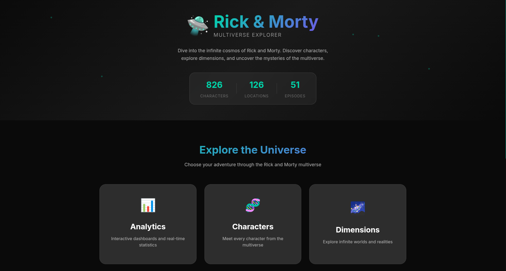

# 🛸 Rick and Morty Universe Explorer

Welcome to the Rick and Morty Universe Explorer\! This project is a web application built with **Vue 3** and **TypeScript**, powered by **Vite**, allowing you to explore characters, locations, and episodes from the Rick and Morty universe using the official [Rick and Morty API](https://rickandmortyapi.com/).

This application provides a sleek, modern interface with interactive features, dynamic data fetching, and a smooth user experience.

-----

## 🚀 Features

  * **Dynamic Character Listing**: Browse through a comprehensive list of all characters from the Rick and Morty universe.
  * **Search & Filter**: Easily find specific characters by name, status (alive, dead, unknown), and species.
  * **Character Details Modal**: Click on any character card to view detailed information in a responsive modal.
  * **Pagination**: Navigate through large datasets of characters with intuitive pagination controls.
  * **Dedicated Sections**:
      * **Characters**: The main interactive section for character exploration.
      * **Locations**: Explore different dimensions and planets (placeholder content, ready for expansion).
      * **Episodes**: Browse through all the wacky adventures (placeholder content, ready for expansion).
      * **Dashboards**: (Placeholder content, ready for analytics and statistics).
  * **Modern UI/UX**: Enjoy a visually appealing interface with smooth animations and responsive design, featuring gradients and subtle effects.
  * **Modular Architecture**: Built with Vue 3's Composition API and TypeScript for a scalable and maintainable codebase, divided into reusable components and views.

-----

## 📸 Screenshots

### Home Page


-----

## 🛠️ Technologies Used

  * **Vue 3**: Progressive JavaScript framework for building user interfaces.
  * **TypeScript**: Strongly typed superset of JavaScript.
  * **Vite**: Next-generation frontend tooling for a fast development experience.
  * **Vue Router**: Official routing library for Vue.js.
  * **Rick and Morty API**: RESTful API for all Rick and Morty data.
  * **CSS3**: For styling and animations.

-----

## ⚙️ Setup and Run

To get this project up and running on your local machine, follow these steps:

1.  **Clone the repository:**

    ```bash
    git clone <your-repository-url>
    cd rick-and-morty-explorer
    ```

2.  **Install dependencies:**
    Choose your preferred package manager:

    ```bash
    npm install
    # or
    yarn install
    # or
    pnpm install
    ```

3.  **Run the development server:**

    ```bash
    npm run dev
    # or
    yarn dev
    # or
    pnpm dev
    ```

    The application will be available at `http://localhost:5173/` (or a similar port).

4.  **Build for production (optional):**

    ```bash
    npm run build
    # or
    yarn build
    # or
    pnpm build
    ```

    This command will create a `dist` folder with the optimized production-ready files.

-----

## 🤝 Contributing

Feel free to fork this repository, make improvements, and open pull requests. Any contributions are welcome\!

-----

## License

This project is open-source and available under the [MIT License](https://www.google.com/search?q=LICENSE).
